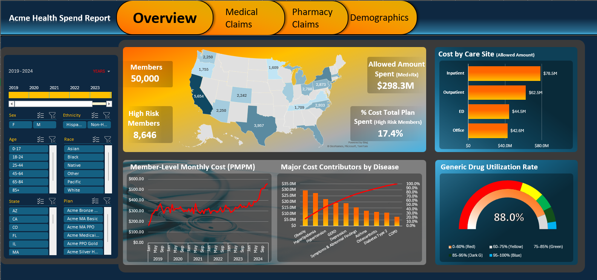
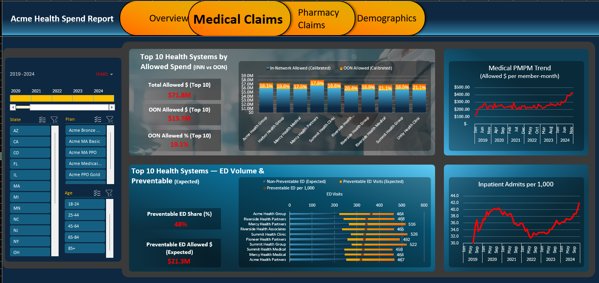
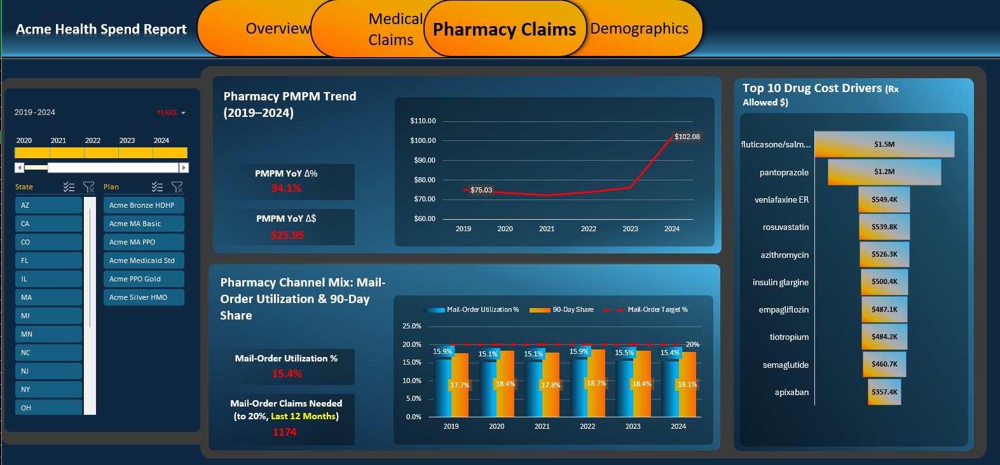
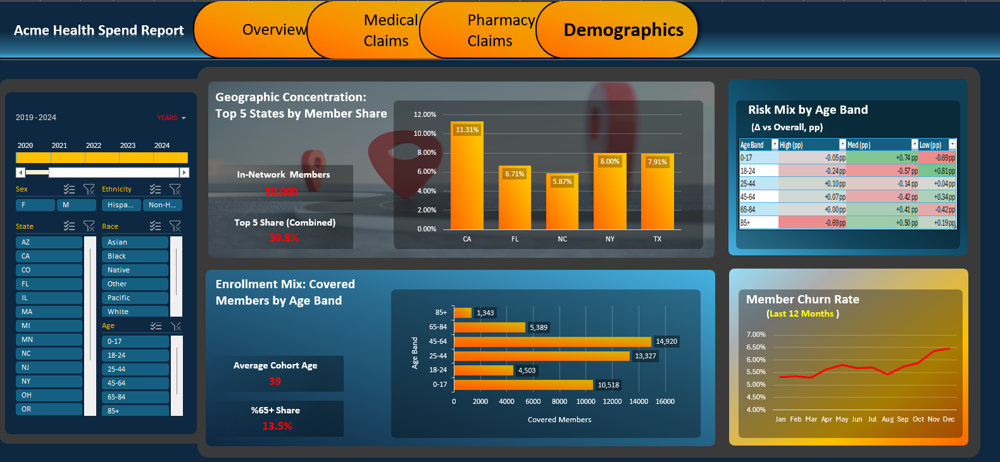

# Acme Health Spend Report (Excel Dashboard)

## Overview
An interactive healthcare spend and utilization dashboard built in Excel using **Power Query**, the **Data Model/Power Pivot**, and **PivotCharts**. It supports analysis of **medical and pharmacy allowed spend**, **utilization**, **risk segmentation**, and **enrollment dynamics** across **2019–2024**, with drilldowns by **plan** and **member demographics**.

> **Synthetic claims dashboard:** This project uses a synthetic/illustrative claims environment for portfolio demonstration (no real patient data).

## Screenshots
### Overview

### Medical Claims

### Pharmacy Claims

### Demographics

## Key Insights Surfaced
This dashboard is designed to surface payer-style insights such as:
- **Cost trend and drivers:** PMPM trends over time with drilldowns to **top medical condition cost contributors** and **top drug spend drivers**
- **Site-of-care opportunity:** Spend mix across **Inpatient / Outpatient / ED / Professional** to support steerage and avoidable utilization narratives
- **Network leakage:** In-network vs out-of-network allowed spend to identify **OON concentration** by plan, system, and geography
- **ED expected mix:** Expected preventable vs non-preventable composition (weighted expectation vs raw counts) for utilization management storytelling
- **Pharmacy efficiency signals:** Generic utilization and channel mix (mail/retail, 30/90-day) to highlight cost-containment levers
- **Population context:** Risk segmentation views to contextualize cost/utilization differences across plans and demographics
- **Enrollment dynamics:** Covered member trends and churn to separate **membership change** from **utilization change**
- **Geographic concentration:** State concentration views to show where membership/spend are most concentrated

## Pages Included
- **Overview:** Enrollment and high-risk counts, total allowed spend, site-of-care mix, PMPM trend, top cost drivers, generic utilization, geographic distribution
- **Medical Claims:** In vs out-of-network allowed, top systems by spend, ED expected mix, medical PMPM trend, inpatient admits per 1,000
- **Pharmacy Claims:** Rx PMPM trend and YoY deltas, top drug cost drivers, fulfillment/channel utilization and 90-day share
- **Demographics:** State concentration, risk mix by age band, covered members by age band, churn trend

## Data (Synthetic)
Data is synthetic and modeled after a typical healthcare analytics structure:
- Medical claims, pharmacy claims, and eligibility/coverage episodes
- Dimensions for members, dates, plans, providers, drugs, diagnoses (ICD-10), and procedures (CPT/HCPCS)
- ED classification weights used to show expected preventable vs non-preventable mix

## Metric Conventions (High-Level)
- **Allowed Amount:** Total allowed spend (medical + pharmacy), with separate medical and pharmacy measures
- **PMPM:** `Allowed Amount / Member Months`
- **Risk Segmentation:** Members grouped into low/medium/high buckets based on diagnosis presence patterns by year
- **Churn:** Month-over-month member presence, displayed as a rolling last-12-months trend

## How to Review
- Use the screenshots above for a quick review of dashboard design and content.
- The Excel workbook is not included in this repository at this time (to keep the repo lightweight). It can be shared upon request, and may be added in a future release.

## Tools
- Excel **Power Query** (ETL and transformations)
- Excel **Data Model / Power Pivot** (relationships and measures)
- **PivotCharts** (interactive visuals)

## Tools
- Excel **Power Query** for data ingestion and transformation
- Excel **Data Model / Power Pivot** for relationships and measures
- **PivotCharts** for interactive visuals
